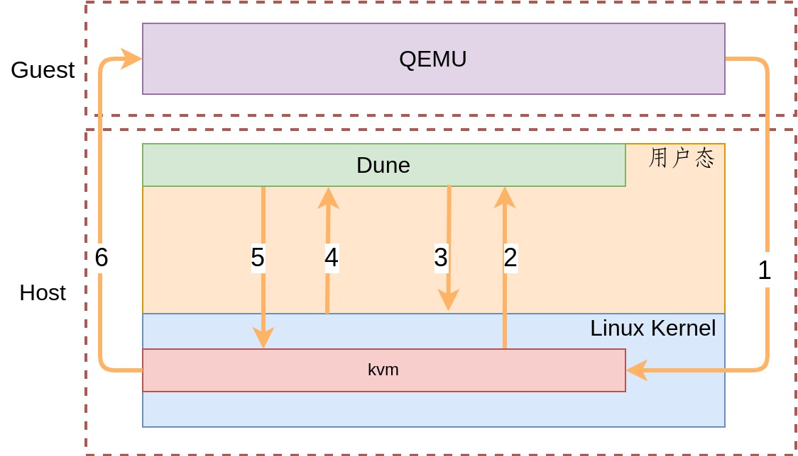

# Loongson Dune

## Project status
| arch      | status |
|-----------|--------|
| MIPS      | 😀     |
| Loongarch | 😀     |
| X86       | 📅     |

If any question, issues and emails are welcomed.

## Advantage over Standford Dune
1. **No kernel module**.
2. No need to write code for intel and amd CPU separately.
3. No need to disable kernel kaslr.
4. Escape dune easily.
   - Process can enter dune and then escape dune whenever it wants to.
5. Nested Dune.
6. Support multiple architectures.
7. Support fork related syscall, multi-thread program works almost perfectly.
8. Much more stable.
9. Less code, only about 1200 loc for one arch(Loongarch).

## Design explanation
1. GVA mapped to HVA 1:1, so the process "feels" the address space is the same even jumps into dune.
2. When guest invoke syscall, it will exit to host by the hypercall, then the syscall is simulated in host userspace.

If the guest process is QEMU，picture below explains what's happeding on a guest syscall.



## Semantic difference with native execution
Process running in dune and host have some minor different behavior.

1. segment fault.

Use following code as a example, in host, segment fault signal will send to the process, the process can register a handler for the signal. But in dune, kvm will `get_user_pages` failed and report the event to dune.
```c
  int * a= (int *)0x4000;

  *a = 12;
```

kernel log when accessing a unmapped area.
```c
[36403.260623] kvm [10252]: TLB ST fault:  cause 0x1080000c, status 0x740000a0, PC: 00000000bc0bbb16, BadVaddr: 0x4000
[36403.260626] kvm [10252]: Failed to find VMA for hva 0x4000
```

2. dune will consume 3 file descriptor for kvm(kvm_dev, vm, vcpu)
    1. fd started at 6 instead of 3.
    2. maximum fd one process can open would be less than expected.

3. `KVM_MAX_VCPU` limits the dune threads.
    1. Loonson dune simulated one thread in the one vcpu, but kvm limits the vcpu number. So the program shouldn't create more than `KVM_MAX_VCPU` threads simultaneously. But one process create vcpu and then release it, it can do it over and over again.

4. signal handler is will executed in host
    1. why : signal handler is executed when return from syscall or interrupt, in dune, it means host's syscall/interrupt return
    2. so what : profil(3) is based on signal handler in which pc is sampled. What is sampled in fact is host process's pc.

5. if seccomp(2) doesn't permit ioctl, then every syscall is forbidden.


## fork/clone
fork/clone is tricky and needs extra attention.

1. KVM disallow fork() and similar games when using a VM, so we should create another vm for child process when child doesn't share the VM.
```c
static long kvm_vcpu_ioctl(struct file *filp,
			   unsigned int ioctl, unsigned long arg)
{
	struct kvm_vcpu *vcpu = filp->private_data;
	void __user *argp = (void __user *)arg;
	int r;
	struct kvm_fpu *fpu = NULL;
	struct kvm_sregs *kvm_sregs = NULL;

	if (vcpu->kvm->mm != current->mm)
		return -EIO;
```
```diff
 History:        #0
 Commit:         6d4e4c4fca5be806b888d606894d914847e82d78
 Author:         Avi Kivity <avi@qumranet.com>
 Author Date:    Wed 21 Nov 2007 10:41:05 PM CST
 Committer Date: Wed 30 Jan 2008 11:53:13 PM CST

 KVM: Disallow fork() and similar games when using a VM

 We don't want the meaning of guest userspace changing under our feet.

 Signed-off-by: Avi Kivity <avi@qumranet.com>
```

2. if child run in a new stack, it can't access local variable anymore, so we need some handcrafted assembly code to handle it.

So there are three types of fork/clone simulation:
```c
enum CLONE_TYPE{
  SAME_VM, // Create vcpu firstly, and do the clone by assembly code
  DIFF_VM_NEW_STACK, // do the fork by assembly code, then create another vm
  DIFF_VM_OLD_STACk, // do the fork, then create another vm
};
```

In `init_child_thread_info`, the child's gpr, especially the stack pointer, tls register and pc will be initilized.

## Disadvantage
Syscall is emulated on host userspace instead of host kernel space. The user / kernel space switch is the overhead that Loonson introduced，but you can eliminate it by kernel modules.
But if [Direct host system calls from KVM](https://lwn.net/Articles/902585/) is possible, there's almost no overhead comparing to native way.
